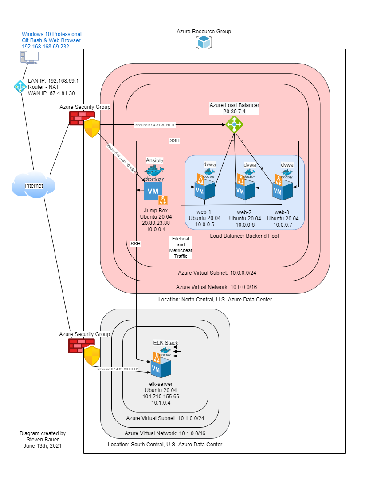
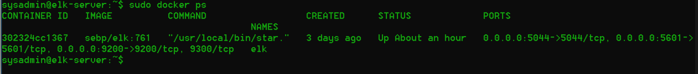
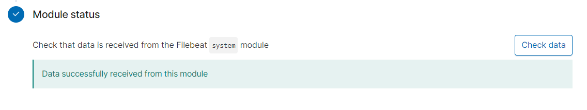
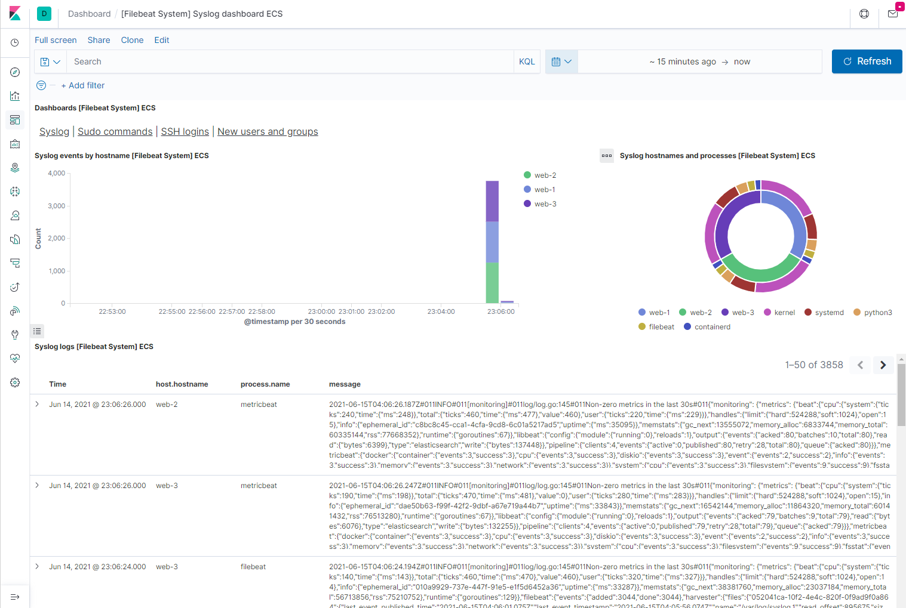
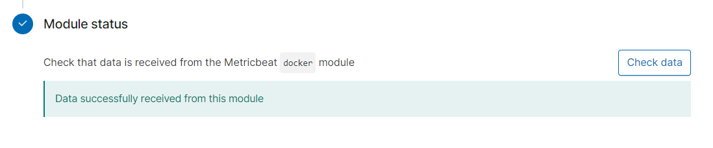
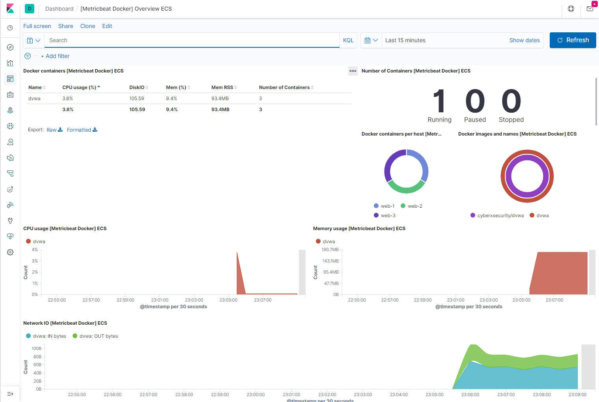

# Automated ELK Stack Deployment

The files in this repository were used to configure the network depicted below.



These files have been tested and used to generate a live ELK Stack deployment within Azure. They can be used to either recreate the entire deployment pictured above. Alternatively, select portions of the `yml` files may be used to install only certain pieces of it, such as Filebeat.

[`dvwa-playbook.yml` used to install DVWA Webservers.](./dvwa/dvwa-playbook.yml)

[`elk-playbook.yml` used to install ELK Stack Server.](./ELK/elk-playbook.yml)

[`filebeat-config.yml` Filebeat service configuration modified and copied to the webservers as `filebeat.yml`.](./Filebeat/filebeat-config.yml)

[`filebeat-playbook.yml` used to install Filebeat Syslog Service on webservers.](./Filebeat/filebeat-playbook.yml)

[`metricbeat-config.yml` Metricbeat service configuration modified and copied to the webserver as `metricbeat.yml`.](./Metricbeat/metricbeat-config.yml)

[`metricbeat-playbook.yml` used to install Metricbeat service on webservers](./Metricbeat/metricbeat-playbook.yml)

This document contains the following details:

- Description of the Topology
- Access Policies
- ELK Configuration
  - Beats in Use
  - Machines Being Monitored
- How to Use the Ansible Build

## Description of the Topology

The main purpose of this network is to expose a load-balanced and monitored instance of DVWA, the D*mn Vulnerable Web Application.

Load balancing ensures that the application will be highly available, in addition to restricting access to the network. A Load Balancers is also one way to mitigate a DoS as it can balance the load accross many web application servers. Typically load balancers include a **health probe** to check all of the servers in its pool are functioning appropriately before sending traffic to them or it will stop sending traffic to missing or poor performing servers.

A Jump Box is similar to a gateway router as it becomes a single point of a protected network exposed to the public network as it sits in front of the other machines that are not exposed to the Internet. To further control access only specified IP addresses and port `22` are allowed access to the Jump Box. SSH has its security issues which is why asynchronous encryption keys were used to ensure a higher degree of protection than usernames and passwords.

Integrating an ELK server allows users to easily monitor the vulnerable VMs for changes to the machine metrics and system logs.

Filebeat is used to capture system logs or file locations you specify then sending data to the ELK Server for indexing and review.

Metricbeat is used to capture machine metrics on Linux, Windows, and Mac hosts then forwarding to the ELK Server to track system level CPU usage, memory, file system, disk I/O, and network I/O metrics.

The configuration details of each machine may be found below.

| Name       | Function    |   IP Address   | Operating System   |
|------------|-------------|----------------|--------------------|
| PSG358-20  | Workstation | 67.4.81.30     | Windows 10 Pro     |
| Jump Box   | Gateway     | 10.0.0.4       | Linux Ubuntu 20.04 |
| web-1      | DVWA        | 10.0.0.5       | Linux Ubuntu 20.04 |
| web-2      | DVWA        | 10.0.0.6       | Linux Ubuntu 20.04 |
| web-3      | DVWA        | 10.0.0.7       | Linux Ubuntu 20.04 |
| elk-server | ELK Stack   | 10.1.0.4       | Linux Ubuntu 20.04 |

### Access Policies

The machines on the internal network are not exposed to the public Internet.

Only the Jump Box machine can accept connections from the Internet. Access to this machine is only allowed from the following Internet IP addresses: 67.4.81.30.

Machines within the network can only be accessed by the Jump Box with the private IP address 10.0.0.4.

A summary of the access policies in place can be found in the table below.

| Name       | Publicly Accessible |  Allowed IP Addresses   |
|------------|---------------------|-------------------------|
| PSG358-20  | Yes                 | 10.0.0.0/16 10.1.0.0/16 |
| Jump Box   | Yes                 | 10.0.0.0/16 10.1.0.0/16 |
| web-1      | No                  | 10.0.0.0/16 10.1.0.0/16 |
| web-2      | No                  | 10.0.0.0/16 10.1.0.0/16 |
| web-3      | No                  | 10.0.0.0/16 10.1.0.0/16 |
| elk-server | No                  | 10.0.0.0/16 10.1.0.0/16 |

### Elk Configuration

Ansible was used to automate the installation and configuration of the ELK Stack. No configuration was performed manually, which is advantageous because it simplifies deployment from a central location that can be used to expand or redeploy the ELK Stack just by running an Ansible playbooks.

The playbook implements the following tasks:

- Install Docker, Python, and the Docker Module.
- Configure the ELK Server memory.
- Download Docker ELK Container and configure it.

The following screenshot displays the result of running `docker ps` after successfully configuring the ELK instance:


## Target Machines & Beats

This ELK server is configured to monitor the following machines:

```bash
10.0.0.5
10.0.0.6
10.0.0.7
```

Only these Beats were installed on the target machines:

- Filebeat
- Metricbeat

These Beats allow us to collect the following information from each machine:

- System log and application log details which include details such as Web Traffic is gathered by Filebeat.
- CPU, Memory, Disk, Network, and other top-like statics are gathered with Metricbeat.

## Using the Playbook

The Playbook is run from the previously configured Ansible control node on the jump box.

SSH into the control node and follow the steps below:

- Copy the configuration file to the `/etc/ansible/files/` to make configuration changes.
- Update the `/etc/ansible/hosts` file to include the targeted machine or machines.
- Create the `<role>-playbook.yml` file with the required tasks to be run by `ansible-playbook`.
- Run the playbook then navigate to the ELK Server Kibana data installation page to check the `Module status` that the installation worked as expected.

The Ansible playbook files were `<role>-playbook.yml` files located on the Jump Server within the Ansible Docker container in the `/etc/ansible/roles/` folder.

To update specific machines we edited the `/etc/ansible/hosts` by ensuring the `[header]` element is not commented out with a `#` or needs to be created then the `hostname/IP` of the machines are added to the file for Ansible to target groups of machines.

Navigating to http://104.210.155.66/app/kibana successfully ensures the ELK Server is running and is ready for use.

## Commands used to install the ELK Stack, Filebeat, and Metricbeat

### I. Install the ELK Stack on the elk server

#### 1. Connected to the Jump Box and attach to the Ansible container

- SSH into the Jump-Box using `ssh sysadmin@20.80.23.88`

- Locate the container name:

```bash
sysadmin@Jump-Box-Provisioner:~$ sudo docker container list -a
CONTAINER ID   IMAGE                          COMMAND                  CREATED       STATUS                   PORTS     NAMES                     
34a0f498a3fc   cyberxsecurity/ansible         "/bin/sh -c /bin/bas…"   2 weeks ago   Exited (0) 4 hours ago             eager_ramanujan
```

- Start the container:

```bash
sysadmin@Jump-Box-Provisioner:~$ sudo docker container start eager_ramanujan
root@34a0f498a3fc:~#
```

- Attach (connect) to the Ansible container:

```bash
sysadmin@Jump-Box-Provisioner:~$ sudo docker container attach eager_ramanujan
root@34a0f498a3fc:~#
```

#### 2. Update the Ansible `hosts` file and create `yml` playbook file

- Add the ELK Server IP address to the Ansible `/etc/ansible/hosts` file creating an `[elk]` section with the IP address:
  
  - Open `hosts` file:

```bash
root@34a0f498a3fc:~# nano /etc/ansible/hosts
```
  
- Add the `[elk]` section followed by the ELK Server IP address:

```bash
[elk]
10.1.0.4
```

- Create the Ansible playbook used to install and configure the `elk` container on the ELK Server virtual machine.

```bash
root@34a0f498a3fc:~# nano /etc/ansible/roles/elk-playbook.yml
```

- The ELK install and configuration tasks can be seen in the [`elk-playbook.yml`](./ELK/elk-playbook.yml) playbook to automate ELK Stack deployment.
  - Comments noted by the `#` indicate each task being performed.
  - Exit `nano` and save the playbook.

#### 3. Running the Playbook and testing the results

- Run the Ansible playbook:

```bash
root@34a0f498a3fc:/etc/ansible/roles# ansible-playbook elk-playbook.yml

PLAY [Configure Elk VM with Docker] ****************************************************

TASK [Gathering Facts] *****************************************************************
ok: [10.1.0.4]

TASK [Install docker.io] ***************************************************************
changed: [10.1.0.4]

TASK [Install python3-pip] *************************************************************
changed: [10.1.0.4]

TASK [Install Docker module] ***********************************************************
changed: [10.1.0.4]

TASK [Increase virtual memory] *********************************************************
changed: [10.1.0.4]

TASK [Increase virtual memory on restart] **********************************************
changed: [10.1.0.4]

TASK [download and launch a docker elk container] **************************************
changed: [10.1.0.4]

TASK [Enable service docker on boot] ***************************************************
changed: [10.1.0.4]

PLAY RECAP *****************************************************************************
10.1.0.4                   : ok=1    changed=7    unreachable=0    failed=0    skipped=0    rescued=0    ignored=0 
```

- After the ELK container is installed, SSH to your container and double-check that your `elk-docker` container is running.

```bash
root@34a0f498a3fc:/etc/ansible/roles# ssh sysadmin@10.1.0.4
sysadmin@elk:~$ sudo docker ps
CONTAINER ID    IMAGE         COMMAND                  CREATED      STATUS         PORTS                                                                              NAMES
302324cc1367   sebp/elk:761   "/usr/local/bin/star…"   9 days ago   Up 2 minutes   0.0.0.0:5044->5044/tcp, 0.0.0.0:5601->5601/tcp, 0.0.0.0:9200->9200/tcp, 9300/tcp   elk
sysadmin@elk-server:~$
```

- First, make sure the ELK server container is up and running.
  - Navigate to <http://104.210.155.66:5601/app/kibana> to verify the ELK Stack is running
  - Use the public IP address of the ELK server from Azure.

### II. Installing Filebeat on the webserver virtual machines

#### 1. Create the Filebeat Configuration File

- Stay `attached` to the Ansible container on the Jump box.
  - See `Step I. Install the ELK Stack on the elk server step 1. Connected to the Jump Box and attach to the Ansible container` for steps to attach to the Ansible container.

  - Copy filebeat-config.yml to the Ansible container.

 ```bash
 root@34a0f498a3fc:/etc/ansible# curl https://gist.githubusercontent.com/slape/5cc350109583af6cbe577bbcc0710c93/raw/eca603b72586fbe148c11f9c87bf96a63cb25760/Filebeat > /etc/ansible/files/filebeat-config.yml
   % Total    % Received % Xferd  Average Speed   Time    Time     Time  Current
                                  Dload  Upload   Total   Spent    Left  Speed
 100 73112  100 73112    0     0   964k      0 --:--:-- --:--:-- --:--:--  964k
 ```

- Edit the Filebeat configuration file to send Beat traffic to the ELK Stack container running on the ELK Server.

```bash
root@34a0f498a3fc:/etc/ansible# nano -l /etc/ansible/files/filebeat-config.yml
```

- To send data to the ELK Server its IP address must be added to the `filebeat-config.yml`.
  - Scroll to line #1105 and set the IP address of the ELK server leaving the port `:9200` in place.
  - Note that the default credentials are `elastic:changeme` and should be changed to the proper `username` and `password`.

```bash
output.elasticsearch:
hosts: ["10.1.0.4:9200"]
username: "elastic"
password: "changeme"
```

- Scroll to line #1805 and replace that IP address with the ELK Server's IP Address and leaving the port `:5601` in place.

```bash
setup.kibana:
host: "10.1.0.4:5601"
```

- Save the file when exiting `nano`.

#### 2. Create and run the Filebeat Installation Playbook file

- Note that when text is copy and pasted from the web into your terminal, formatting differences are likely to occur that will corrupt this configuration file.

- Overview of the playbook tasks performed on the webservers:
  - Download the `.deb` file from [artifacts.elastic.co](https://artifacts.elastic.co/downloads/beats/filebeat/filebeat-7.6.1-amd64.deb).
  - Install the `.deb` file using the `dpkg` command shown below:
    - `dpkg -i filebeat-7.6.1-amd64.deb`
  - Copy the Filebeat configuration file from the Ansible container to webservers.
    - Used the Ansible module `copy` to copy the entire configuration file into the correct place.
  - Run the `filebeat modules enable system` command.
  - Run the `filebeat setup` command.
  - Run the `service filebeat start` command.
  - Enable the Filebeat service on boot.

- Build the playbook from the task overview using `nano`, Ansible, and Eleastic documentation.

```bash
root@34a0f498a3fc:~# nano /etc/ansible/roles/filebeat-playbook.yml
```

- The Filebeat install and configuration tasks can be seen in the the [`filebeat-playbook.yml`](./Filebeat/filebeat-playbook.yml) playbook to automate the deployment of Filebeat.
  - Comments noted by the `#` indicate each task being performed.
  - Exit `nano` and save the playbook.

#### 3. Running the Filebeat playbook

Note: The `/etc/ansible/hosts` file already had a [webservers] section populated with the webserver when the DVWA container was installed and did not need to be modified.

```bash
root@34a0f498a3fc:/etc/ansible# ansible-playbook /etc/ansible/roles/filebeat-playbook.yml

PLAY [Installing and Launching Filebeat] *******************************************************

TASK [Gathering Facts] *************************************************************************
ok: [10.0.0.5]
ok: [10.0.0.6]
ok: [10.0.0.7]

TASK [Download filebeat .deb file] *************************************************************
[WARNING]: Consider using the get_url or uri module rather than running 'curl'.  If you need to
use command because get_url or uri is insufficient you can add 'warn: false' to this command
task or set 'command_warnings=False' in ansible.cfg to get rid of this message.

changed: [10.0.0.5]
changed: [10.0.0.6]
changed: [10.0.0.7]

TASK [Install filebeat .deb] ********************************************************************
changed: [10.0.0.5]
changed: [10.0.0.6]
changed: [10.0.0.7]

TASK [Drop in filebeat.yml] ********************************************************************
ok: [10.0.0.5]
ok: [10.0.0.6]
ok: [10.0.0.7]

TASK [Enable and Configure System Module] ******************************************************
changed: [10.0.0.5]
changed: [10.0.0.6]
changed: [10.0.0.7]

TASK [Setup filebeat] **************************************************************************
changed: [10.0.0.5]
changed: [10.0.0.6]
changed: [10.0.0.7]

TASK [Start filebeat service] ******************************************************************
[WARNING]: Consider using the service module rather than running 'service'.  If you need to use
command because service is insufficient you can add 'warn: false' to this command task or set
'command_warnings=False' in ansible.cfg to get rid of this message.

changed: [10.0.0.5]
changed: [10.0.0.6]
changed: [10.0.0.7]

TASK [Enable service filebeat on boot] **************************************************************************
changed: [10.0.0.5]
changed: [10.0.0.6]
changed: [10.0.0.7]

PLAY RECAP *************************************************************************************
10.0.0.5                  : ok=7    changed=6    unreachable=0    failed=0    skipped=0    rescued=0    ignored=0
10.0.0.6                  : ok=7    changed=6    unreachable=0    failed=0    skipped=0    rescued=0    ignored=0
10.0.0.7                   : ok=7    changed=6    unreachable=0    failed=0    skipped=0    rescued=0    ignored=0
```

- The playbook ran successfully as there were no unreachable, failed, skipped, rescued, or ignored issues.

#### 4. Verifying Filebeat Installation

- Go to the Kibana website <http://104.210.155.66:5601/app/kibana> to verify that the ELK Stack is running and receiving data.
  - Click on **Add Log Data**.
  - Choose **System Logs**.
  - Click on the **DEB** tab under **Getting Started** where you will see the Linux Filebeat installation instructions.
  - Scroll **Module status** and click **Check Data** to ensure we get a check by the **Module status**.



- Scroll to the bottom and click on **System logs dashboard** to see Kibana presenting System Log data.



### Success ELK stack was receiving log data as seen in the screenshots above

### III. Installing Metricbeat on the webserver virtual machines

#### 1. Create the Metricbeat Configuration File

- Stay `attached` to the Ansible container on the Jump box.
  - See `Step I. Install the ELK Stack on the elk server step 1. Connected to the Jump Box and attach to the Ansible container` for steps to attach to the Ansible container.

  - Copy metric-config.yml to the Ansible container.

 ```bash
 root@34a0f498a3fc:/etc/ansible# curl https://gist.githubusercontent.com/slape/58541585cc1886d2e26cd8be557ce04c/raw/0ce2c7e744c54513616966affb5e9d96f5e12f73/metricbeat > /etc/ansible/files/metricbeat-config.yml
   % Total    % Received % Xferd  Average Speed   Time    Time     Time  Current
                                  Dload  Upload   Total   Spent    Left  Speed
  00  6188  100  6188    0     0  21337      0 --:--:-- --:--:-- --:--:-- 21337
 ```

- Edit the Metricbeat configuration file to send Beat traffic to the ELK Stack container running on the ELK Server.

```bash
root@34a0f498a3fc:/etc/ansible# nano -l /etc/ansible/files/metricbeat-config.yml
```

- To send data to the ELK Server its IP address must be added to the `metricbeat-config.yml`.
  - Scroll to line #62 and set the IP address of the ELK Server leaving the port `:5601` in place.

```bash
setup.kibana:
host: "10.1.0.4:5601"
```

- Scroll to line #95 to set the IP of the ELK Server and leaving the port `:9200` in place.
  - Note that the default credentials are `elastic:changeme` and should be changed to the proper `username` and `password`.

```bash
output.elasticsearch:
hosts: ["10.1.0.4:9200"]
username: "elastic"
password: "changeme"
```

- Save the file when exiting `nano`.

#### 2. Create and run the Metricbeat Installation Playbook file

- Reminder that when text is copy and pasted from the web into your terminal, formatting differences are likely to occur that will corrupt this configuration file.

- Overview of the playbook tasks performed on the webservers:
  - Download the [Metricbeat `.deb` file](https://artifacts.elastic.co/downloads/beats/metricbeat/metricbeat-7.6.1-amd64.deb).
  - Install the `.deb` file using the `dpkg` command shown below:
    - `dpkg -i metricbeat-7.6.1-amd64.deb`
  - Copy the Metricbeat configuration file from the Ansible container to webservers.
    - Used the Ansible module `copy` to copy the entire configuration file into the correct place.
  - Run the `metricbeat modules enable docker` command.
  - Run the `metricbeat setup` command.
  - Run the `service metricbeat start` command.
  - Enable the Metricbeat service on boot.

- Build the playbook from the task overview using `nano`, Ansible, and Eleastic documentation.

```bash
root@34a0f498a3fc:~# nano /etc/ansible/roles/metricbeat-playbook.yml
```

- The Metricbeat install and configuration tasks can be seen in the the [`metricbeat-playbook.yml`](./Metricbeat/metricbeat-playbook.yml) playbook to automate the deployment of Metricbeat.
  - Comments noted by the `#` indicate each task being performed.
  - Exit `nano` and save the playbook.

#### 3. Running the Metricbeat playbook

Note: The `/etc/ansible/hosts` file already had a [webservers] section populated with the webserver when the DVWA container was installed and did not need to be modified.

```bash
root@34a0f498a3fc:/etc/ansible/roles# ansible-playbook metricbeat-playbook.yml

PLAY [Install metric beat] **************************************************************************************************

TASK [Gathering Facts] ******************************************************************************************************
ok: [10.0.0.5]
ok: [10.0.0.6]
ok: [10.0.0.7]

TASK [Download metricbeat] **************************************************************************************************
changed: [10.0.0.5]
changed: [10.0.0.6]
changed: [10.0.0.7]

TASK [Install metricbeat] ***************************************************************************************************
changed: [10.0.0.5]
changed: [10.0.0.6]
changed: [10.0.0.7]

TASK [Drop in metricbeat config] ********************************************************************************************
changed: [10.0.0.5]
changed: [10.0.0.6]
changed: [10.0.0.7]

TASK [Enable and configure docker module for metric beat] *******************************************************************
changed: [10.0.0.5]
changed: [10.0.0.6]
changed: [10.0.0.7]

TASK [Setup metric beat] ****************************************************************************************************
changed: [10.0.0.5]
changed: [10.0.0.6]
changed: [10.0.0.7]

TASK [Start metric beat] ****************************************************************************************************
changed: [10.0.0.5]
changed: [10.0.0.6]
changed: [10.0.0.7]

TASK [Enable service metricbeat on boot] ************************************************************************************
changed: [10.0.0.5]
changed: [10.0.0.6]
changed: [10.0.0.7]

PLAY RECAP ******************************************************************************************************************
10.0.0.5                   : ok=8    changed=7    unreachable=0    failed=0    skipped=0    rescued=0    ignored=0
10.0.0.6                   : ok=8    changed=7    unreachable=0    failed=0    skipped=0    rescued=0    ignored=0
10.0.0.7                   : ok=8    changed=7    unreachable=0    failed=0    skipped=0    rescued=0    ignored=0
 rescued=0    ignored=0
```

- The playbook ran successfully as there were no unreachable, failed, skipped, rescued, or ignored issues.

#### 4. Verifying Metric Beat Installation

- Go to the Kibana website http://104.210.155.66:5601/app/kibana to verify that the ELK Stack is running and receiving data.
  - Click **Add Metric Data**.
  - Click **Docker Metrics**.
  - Click the **DEB** tab under **Getting Started** where you will see Linux Metricbeat instructions.
  - Scroll **Module status** and click **Check Data** to ensure we get a check by the **Module status**.



- Scroll to the bottom and click on **Docker metrics dashboard**.



### Metricbeat was successfully sengin data to the ELK stack the screenshots above

## **Thank you for checking this out, I learned a lot in creating it**
