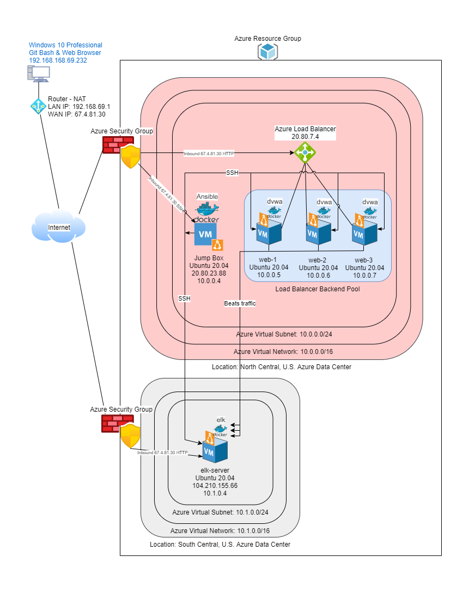

# ELK-Stack-Deployment
Scripts, diagrams and documentation used to deploy an ELK Stack deployment in Azure.

## Automated ELK Stack Deployment

The files in this repository were used to configure the network depicted below.

These files have been tested and used to generate a live ELK Stack deployment on Azure. They can be used to either recreate the entire deployment pictured above. Alternatively, select portions of the `yml` files may be used to install only certain pieces of it, such as Filebeat.

[Install DVWA Web Server Playbook](./dvwa/install-dvwa.yml)
[Install ELK Stack Server Playbook](./ELK/install-elk.yml)
[Install Filebeat Syslog Service Playbook](./Filebeat/filebeat-playbook.yml)
[Install Docker Metrics Service Playbook](./Metricbeat/metricbeat-playbook.yml)

This document contains the following details:
- Description of the Topology
- Access Policies
- ELK Configuration
  - Beats in Use
  - Machines Being Monitored
- How to Use the Ansible Build

### Description of the Topology

The main purpose of this network is to expose a load-balanced and monitored instance of DVWA, the D*mn Vulnerable Web Application.

Load balancing ensures that the application will be highly available, in addition to restricting access to the network. Load balancers are also one way to mitigate a DoS as it can balance the load accress many web application servers. Typically load balancers include a **health probe** to check all of the servers in its pool are functioning appropiately before sending traffic to them or it will stop sending traffic to missing or poor perfoming servers.

A Jump Box is similar to a gateway router as it becomes a single point of a protected network exposed to the public network as it sits in front of the other machines that are not exposed to the Internet. To further control access only specified IP addresses and port `22` are allowed access to the Jump Box. SSH has it is security issues and that is why asynchronous encryption keys were used to esnure a higher degree of protection than usernames and passwords. 

Integrating an ELK server allows users to easily monitor the vulnerable VMs for changes to the log data and system logs.

Filebeat watches the system log data
- _TODO: What does Metricbeat record?_

The configuration details of each machine may be found below.

| Name       | Function    |   IP Address   | Operating System   |
|------------|-------------|----------------|--------------------|
| PSG358-20  | Workstation | 192.168.69.232 | Windows 10 Pro     |
| Jump Box   | Gateway     | 10.0.0.4       | Linux Ubuntu 20.04 |
| web-1      | DVWA        | 10.0.0.5       | Linux Ubuntu 20.04 |
| web-2      | DVWA        | 10.0.0.6       | Linux Ubuntu 20.04 |
| web-3      | DVWA        | 10.0.0.7       | Linux Ubuntu 20.04 |
| elk-server | ELK Stack   | 10.1.0.4       | Linux Ubuntu 20.04 |

### Access Policies

The machines on the internal network are not exposed to the public Internet. 

Only the _____ machine can accept connections from the Internet. Access to this machine is only allowed from the following IP addresses:
- _TODO: Add whitelisted IP addresses_

Machines within the network can only be accessed by _____.
- _TODO: Which machine did you allow to access your ELK VM? What was its IP address?_

A summary of the access policies in place can be found in the table below.

| Name     | Publicly Accessible | Allowed IP Addresses |
|----------|---------------------|----------------------|
| Jump Box | Yes                 | 10.0.0.1 10.0.0.2    |
|          |                     |                      |
|          |                     |                      |

### Elk Configuration

Ansible was used to automate configuration of the ELK machine. No configuration was performed manually, which is advantageous because...
- _TODO: What is the main advantage of automating configuration with Ansible?_

The playbook implements the following tasks:
- _TODO: In 3-5 bullets, explain the steps of the ELK installation play. E.g., install Docker; download image; etc._
- ...
- ...

The following screenshot displays the result of running `docker ps` after successfully configuring the ELK instance.

**Note**: The following image link needs to be updated. Replace `docker_ps_output.png` with the name of your screenshot image file.  

### Target Machines & Beats
This ELK server is configured to monitor the following machines:
- _TODO: List the IP addresses of the machines you are monitoring_

We have installed the following Beats on these machines:
- _TODO: Specify which Beats you successfully installed_

These Beats allow us to collect the following information from each machine:
- _TODO: In 1-2 sentences, explain what kind of data each beat collects, and provide 1 example of what you expect to see. E.g., `Winlogbeat` collects Windows logs, which we use to track user logon events, etc._

### Using the Playbook
In order to use the playbook, you will need to have an Ansible control node already configured. Assuming you have such a control node provisioned: 

SSH into the control node and follow the steps below:
- Copy the _____ file to _____.
- Update the _____ file to include...
- Run the playbook, and navigate to ____ to check that the installation worked as expected.

_TODO: Answer the following questions to fill in the blanks:_
- _Which file is the playbook? Where do you copy it?_
- _Which file do you update to make Ansible run the playbook on a specific machine? How do I specify which machine to install the ELK server on versus which to install Filebeat on?_
- _Which URL do you navigate to in order to check that the ELK server is running?

_As a **Bonus**, provide the specific commands the user will need to run to download the playbook, update the files, etc._

